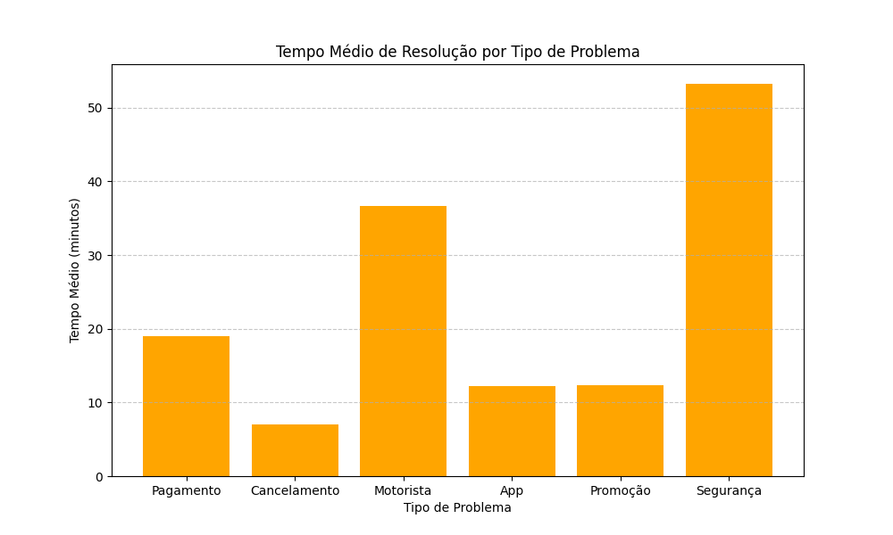

# 📊 Análise de Performance de Atendimento (Simulação 99/DiDi)

Este projeto é uma ferramenta de análise de dados desenvolvida em **Python** para monitorar KPIs (Indicadores-Chave de Desempenho) de suporte ao usuário. 

O objetivo é automatizar a identificação de **gargalos operacionais** em chamados de ride-hailing, comparando volume, tempo de resolução e satisfação do cliente (CSAT).

---

##  Contexto do Projeto

Como estudante de **Ciência da Computação (UFCG)** e atuando na operação de atendimento da **99**, percebi a importância de transformar dados brutos do suporte em insights observaveis.

Este script processa uma base de dados (simulada) e responde automaticamente:
1. Qual o tipo de problema mais frequente? (Ofensores de volume)
2. Qual problema demora mais para ser resolvido? (Ofensores de eficiência)
3. Qual a relação entre demora e nota do usuário?

---

##  Tecnologias Utilizadas

* **Linguagem:** Python 3
* **Manipulação de Arquivos:** Biblioteca `csv` (nativa) e `os`
* **Lógica de Negócio:** Algoritmos de agregação, ordenação e detecção de anomalias.
* **Estrutura de Dados:** Dicionários e Listas para processamento em memória.

---

##  Funcionalidades

✅ **Leitura de Dados Estruturados:** Importação automática de arquivos `.csv`.
✅ **Tratamento de Tipos:** Conversão e sanitização de dados (String -> Int/Float).
✅ **Cálculo de Médias:** Processamento estatístico de tempo e notas por categoria.
✅ **Insight Automático:** O sistema possui uma regra de negócio que identifica sozinho o "Gargalo Crítico" (problemas com tempo de resolução acima do SLA ideal).

---

##  Visualização dos Dados

O script gera automaticamente um gráfico para facilitar a identificação dos gargalos:



---

##  Estrutura do Projeto

```text
projeto_analise_99/
│
├── dados/
│   └── chamados_99.csv   # Dataset simulado com colunas: id, problema, tempo, nota, regiao
│
├── src/
│   └── analise.py        # Script principal de processamento e lógica
│
└── README.md             # Documentação

## 👨‍💻 Autor

Desenvolvido por **Xavier, Thalysson**
*Graduando em Ciência da Computação @ UFCG*
*Experiência em Customer Experience @*